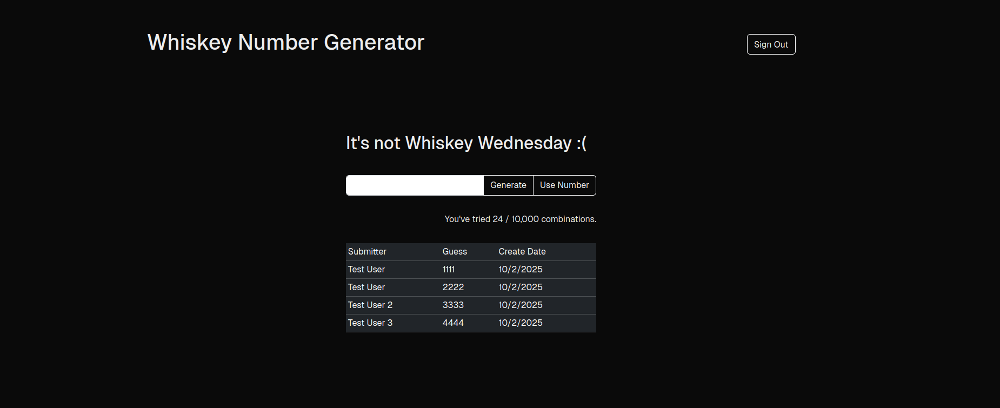

# Rogue Numbers

## About The Project



Rogue Numbers is a fun little app built for a group of friends as we try to win a bottle of whiskey at our favorite local restaurant. We needed a way to track our guesses and come up with numbers we hadn't tried yet.

## Getting Started

### Installation

1. Clone the repo
```
git clone https://github.com/melockwood94/rogue-numbers.git
```
2. Install NPM packages
```
npm install
```
3. Create a .env file and configure it with the following variables
```
BETTER_AUTH_SECRET=
BETTER_AUTH_URL=http://localhost:3000
URL=http://localhost:3000
OAUTH_PROVIDERID=rogue-numbers
OAUTH_CLIENTID=
OAUTH_=
OAUTH_DISCOVERYURL=
```
4. Perform database migrations
```
npx @better-auth/cli migrate
npx prisma migrate dev

```
5. Run the dev server
```
npm run dev
```
6. Open [http://localhost:3000](http://localhost:3000) in your browser and sign-in
